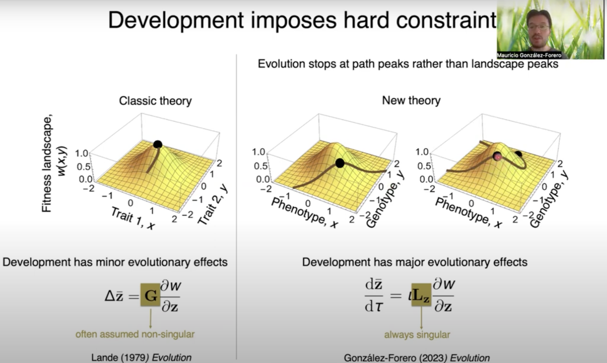

## [Home](https://mauriciogforero.github.io) / [Research](https://mauriciogforero.github.io/research) / [Publications](https://mauriciogforero.github.io/publications) / [CV](https://mauriciogforero.github.io/cv) / [Funding](https://mauriciogforero.github.io/funding)

  "There is nothing more practical than a good theory".

  

  Business man quoted by K. Lewin (1943). Psychology and the process of group living. J. Social Psych. 17, 113-131.  

 
 

Welcome. I am an evolutionary biologist working at the interface of biology, mathematics, and anthropology. 

I use mathematical modelling to address questions including why the human brain evolved, how development affects evolution, why major evolutionary transitions occurred, and what a species is. 

As part of this work, I have developed mathematical tools that integrate development and evolution. These tools have produced general formulas for computing how a system responds to perturbation, how to translate an understanding of development into an understanding of evolution, and how to model the development and evolution of human brain size and cognitive ability. 

Email: Mauricio.GonzalezForero [at] gmail.com 

[Google scholar](https://scholar.google.com/citations?authuser=1&user=WIXuy2kAAAAJ)  
[Orcid](https://orcid.org/0000-0003-1015-3089)  
[Mastodon](https://fediscience.org/deck/@MauricioGForero)  
[Research gate](https://www.researchgate.net/profile/Mauricio-Gonzalez-Forero)  
[LinkedIn](https://www.linkedin.com/in/mauricio-gonzalez-forero/)  
[Bluesky](https://bsky.app/profile/mauriciogforero.bsky.social)  

Here is a 15-min overview of my research, given as a virtual talk at the 2024 Evolution Conference:

