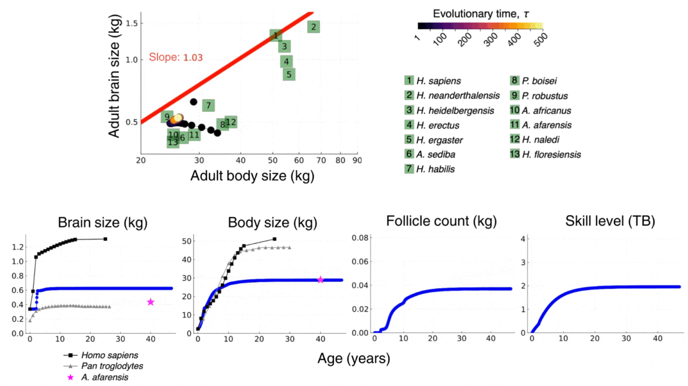

## [Home](https://mauriciogforero.github.io) / [Research](https://mauriciogforero.github.io/research) / [Publications](https://mauriciogforero.github.io/publications) / [CV](https://mauriciogforero.github.io/cv) / [Funding](https://mauriciogforero.github.io/funding)

# Human brain evolution

Brains have evolved into a stunning diversity across the animal kingdom giving rise to an even more stunning diversity in behavior. What drives brain evolution? We developed a mathematical model to help address this question ([González-Forero, Faulwasser, and Lehmann, 2017](https://journals.plos.org/ploscompbiol/article?id=10.1371/journal.pcbi.1005380)).
​
Using this model, we have found that cognitive ability and brain mass can be mechanistically related by a simple equation. Extending this model to social interactions, we have also found causal, computational evidence suggesting that human brain expansion may have been driven by ecological and cultural factors, rather than social factors such as cooperation and competition, contrasting with dominant hypotheses ([González-Forero and Gardner, 2018](https://rdcu.be/O1Vc)).
​
In a further extension of this work modelling the developmental and evolutionary (evo-devo) dynamics of hominin brain size, I have found that, counterintuitively, the sharp expansion in brain size in the human lineage may have been caused by constraints rather than selection ([González-Forero, 2024b](https://www.nature.com/articles/s41562-024-01887-8)).

 
This video shows the evolutionary and developmental dynamics of the human brain as predicted by the model. The video shows the evolution of adult brain and body sizes from australopithecine to sapiens scales, the evolution of an adolescencent growth spurt, the evolution of a long childhood period, and the evolution of a doubling in adult skill level. The video is taken from [González-Forero, 2024b](https://www.nature.com/articles/s41562-024-01887-8).

# How development affects evolution

The modern evolutionary synthesis of the 1930s and 1940s unified Darwinian evolution and Mendelian inheritance. Since then, many researchers have called for an analogous synthesis between evolutionary and developmental biology, arguing that the lack of such synthesis has limited evolutionary understanding. 

I formulated a mathematical framework that integrates evolutionary and developmental dynamics, yielding deep insights into how development affects evolution ([González-Forero 2024a](https://www.sciencedirect.com/science/article/pii/S0040580923000758)). The framework sharpens Wright’s principle — according to which adaptation by natural selection occurs such that the population climbs the fitness landscape — showing that development provides the admissible evolutionary path and invariably induces hard constraints on adaptation. This means that evolution stops at such path peak rather than at the peaks of the fitness landscape as commonly assumed. Since changing the path changes the path peak, this in turn means that development has major evolutionary effects, contrasting with long-held views ([González-Forero 2023](https://academic.oup.com/evolut/article/77/2/562/6955321)).
​
An important illustration of this result is that changing development alone (i.e., the path) without changing selection (i.e., the landscape) can lead to the evolution of the massive human brain size from australopithecine ancestors ([González-Forero, 2024b](https://www.nature.com/articles/s41562-024-01887-8)).

# Social evolution

In major evolutionary transitions, groups of individuals become higher level individuals, which has had major effects on life on earth. What causes such major transitions?
​
We have developed mathematical models to study a classic hypothesis that posits that one such major transition, i.e., eusociality, arose from ancestral maternal manipulation. The hypothesis suggests that workers in eusocial organisms evolved because mothers manipulate their offspring to become helpers. Although this hypothesis attracted interest in 1970s, evidence has since been interpreted as rejecting it because it was thought that manipulation would lead offspring to resist whereas eusocial offspring seem to help voluntarily. We have found that manipulation may evolve while resistance fails to evolve for various reasons, so eusociality can evolve from ancestral manipulation yielding voluntarily helping offspring, consistently with various patterns observed in eusocial taxa (e.g., [González-Forero and Peña, 2021](https://royalsocietypublishing.org/doi/10.1098/rspb.2021.0386)).

# Species problem

Species are key units for evolutionary inference and conservation policies, but they are infamously difficult to define. I developed a mathematical formalization of the biological species concept and explored its consequences.
​
During my undergraduate thesis, I found that one out of four mathematical interpretations of this concept overcomes various difficulties of the verbal concept, but in doing so populations can belong to multiple species ([González-Forero, 2009](FullJTB09.pdf)).
